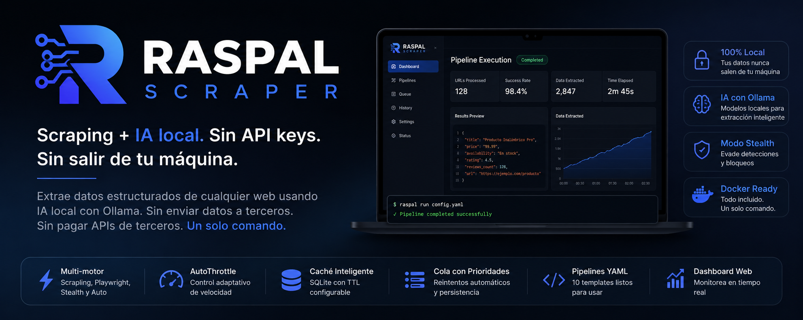

# **RASPAL SCRAPER**

<p align="center">
  
</p>

<p align="center">
  
  
  
  
  
  
  
  
  
</p>

> Scraping + local AI. No API keys. No data leaving your machine.
> Español • [English](#english)

**RASPAL SCRAPER** extrae datos estructurados de cualquier web usando IA local. Sin enviar datos a terceros. Sin pagar APIs de terceros. Un solo comando.
Extract structured data from any website using local AI. No third-party APIs. One command.

```bash
# Recomendado: Docker (todo incluido)
git clone https://github.com/juandelaf1/RASPAL_SCRAPER.git
cd RASPAL_SCRAPER
docker compose up -d
docker compose run raspal raspal demo

# Alternativa: pip install
pip install raspal && raspal setup
raspal fetch https://ejemplo.com
raspal run config.yaml
```

---

## 🐳 Inicio rápido con Docker

La forma más fácil de probar RASPAL SCRAPER es con Docker. Sin instalar Python, sin dependencias manuales, sin configurar Ollama.

```bash
# 1. Clonar
git clone https://github.com/juandelaf1/RASPAL_SCRAPER.git
cd RASPAL_SCRAPER

# 2. Arrancar todo (Ollama + RASPAL)
docker compose up -d

# 3. Ejecutar demo
docker compose run raspal raspal demo
```

**Qué incluye:**
- Imagen optimizada con Python 3.11 + todas las dependencias
- Playwright browsers preinstalados
- Ollama corriendo en un contenedor separado
- Modelo `llama3.2:3b` descargado automáticamente
- Volúmenes persistentes para cache, outputs y pipelines

Ver [`docs/quickstart-docker.md`](docs/quickstart-docker.md) para troubleshooting y más detalles.

---

## 🤔 Por que RASPAL vs otras opciones?

| Necesitas... | Firecrawl | Apify | Browse.ai | Scrapy | **RASPAL** |
|---|---|---|---|---|---|
| Sin enviar datos a terceros | ❌ | ❌ | ❌ | ✅ | **✅** |
| Sin pagar por API | ❌ | ❌ | ❌ | ✅ | **✅** |
| Un solo comando para empezar | ❌ | ❌ | ❌ | ❌ | **✅** |
| IA local (Ollama) | ❌ | ❌ | ❌ | ❌ | **✅** |
| Modo stealth para sitios protegidos | ❌ | ❌ | ❌ | ❌ | **✅** |
| Docker listo para usar | ❌ | ✅ | ❌ | ❌ | **✅** |
| Open source (MIT) | ❌ | ❌ | ❌ | ✅ | **✅** |
| Precio | $10+/mes | $49+/mes | $49+/mes | Gratis | **Gratis** |

**RASPAL no es un reemplazo de Scrapy para proyectos grandes. RASPAL es para cuando queres extraer datos estructurados de una web en segundos, sin configurar infraestructura, sin pagar APIs, y sin que tus datos salgan de tu maquina.**

---

## ⚡ Comandos

### CLI

```bash
# Setup del entorno
raspal setup                      # instala browsers, verifica Ollama

# Diagnóstico del sistema
raspal doctor                     # verifica Python, Ollama, Playwright, permisos

# Verificación legal básica
raspal compliance https://ejemplo.com  # robots.txt, dominio sensible

# Crear proyecto
raspal init                       # scaffold interactivo

# Fetch básico
raspal fetch https://ejemplo.com

# Con motor específico
raspal fetch https://ejemplo.com --engine playwright
raspal fetch https://ejemplo.com --engine stealth

# Fetch asíncrono (más rápido)
raspal async-fetch https://ejemplo.com

# Múltiples URLs en paralelo
raspal async-batch https://ejemplo.com https://httpbin.org/json

# Validación de config
raspal validate config.yaml          # verifica que el YAML es correcto

# Pipeline desde YAML
raspal run config.yaml

# Cola de URLs con prioridades
raspal queue config.yaml --db queue.sqlite -o results.json

# Reporte HTML
raspal report --input results.json --output report.html

# Dashboard web
raspal serve                      # http://127.0.0.1:8462

# Estado del throttle
raspal status

# Limpiar caché
raspal clear-cache

# Versión
raspal version
```

### Python API

```python
from raspal import Fetcher, Extractor, LLMExtractor

# 1. Fetch
f = Fetcher()
result = f.fetch("https://ejemplo.com", engine="auto")
html = result.html

# 2. Extraer texto y metadata
ext = Extractor()
texto = ext.extract_text(html)
metadata = ext.extract_metadata(html)

# 3. Extracción selectores CSS
data = ext.extract_selectors(html, {
    "titulo": "h1",
    "precio": ".price",
    "descripcion": ".description"
})

# 4. Extracción con IA local (Ollama)
llm = LLMExtractor()
producto = llm.extract(texto, template="product")
# → {"name": "...", "brand": "...", "price": "...", "availability": "..."}
```

### Pipelines YAML

```yaml
# config.yaml
url: "https://ejemplo.com/productos"
engine: auto
extract:
  text: true
  metadata: true
  selectors:
    title: "h1.product-title"
    price: "span.price"
llm:
  template: "product"
  prompt: "Extrae nombre, precio y disponibilidad como JSON"
```

```bash
raspal run config.yaml
```

---

## 🧠 Extracción con IA (Ollama)

Usa modelos locales para estructurar datos sin depender de APIs externas.

```python
# Templates predefinidos
llm.extract(texto, template="product")   # nombre, marca, precio...
llm.extract(texto, template="article")   # título, autor, fecha...
llm.extract(texto, template="person")    # nombre, rol, contacto...
llm.extract(texto, template="review")    # rating, pros, contras...
llm.extract(texto, template="event")     # fecha, lugar, organizador...

# Esquema JSON personalizado
llm.extract(texto, template="product", output_schema={
    "name": "",
    "price": 0.0,
    "rating": 0.0,
    "in_stock": False
})

# Cadenas multi-paso (classify → extract)
chain = [
    ChainStep(name="categoria", prompt="¿Esto es un producto o un artículo?"),
    ChainStep(name="detalles", prompt="Extrae información clave",
              output_schema={"title": "", "price": ""}),
]
llm.extract_chain(texto, chain)
```

---

## ⚡ Async

```python
from raspal import AsyncFetcher

async with AsyncFetcher(max_workers=8) as fetcher:
    results = await fetcher.fetch_batch([
        "https://ejemplo.com/pagina1",
        "https://ejemplo.com/pagina2",
        "https://ejemplo.com/pagina3",
    ])
```

Procesa cientos de URLs en paralelo con aislamiento por proceso para Playwright.

---

## 🎛️ Motores

| Motor | Librería | Ideal para |
|-------|----------|-----------|
| `scrapling` | curl_cffi | HTML estático, rápida |
| `playwright` | Playwright | JS pesado, SPAs |
| `stealth` | Playwright + anti-detect | Cloudflare, Turnstile |
| `auto` | — | Selección automática |

---

## 📂 10 templates YAML

Pipelines listos para usar. Cada uno con selectores CSS + extraccion IA:

```bash
raspal run examples/ecommerce-products.yaml     # Productos, precios, disponibilidad
raspal run examples/competitor-pricing.yaml     # Monitoreo de precios competencia
raspal run examples/product-reviews.yaml        # Resenas con sentimiento IA
raspal run examples/news-article.yaml           # Titular, autor, resumen
raspal run examples/job-scraper.yaml            # Ofertas de empleo
raspal run examples/academic-research.yaml      # Papers, abstracts, citas
raspal run examples/real-estate-listings.yaml   # Listados inmobiliarios
raspal run examples/crypto-prices.yaml          # Precios cripto 24h
raspal run examples/business-directory.yaml     # Datos de contacto
raspal run examples/linkedin-company.yaml       # Perfiles publicos empresa
```

Ver [`examples/README.md`](examples/README.md) para descripcion de cada uno.

---

## 📦 Componentes

| Componente | Descripción |
|-----------|-------------|
| `Fetcher` | Fetch multi-motor con caché y throttle |
| `AsyncFetcher` | Versión asíncrona con ProcessPoolExecutor |
| `Extractor` | Extracción de texto, metadata y selectores |
| `LLMExtractor` | Extracción estructurada con Ollama |
| `Cache` | Caché SQLite con TTL configurable |
| `AutoThrottle` | Control adaptativo de velocidad |
| `RequestQueue` | Cola persistente con prioridades y reintentos |
| `Pipeline` | Pipeline de recolección con salida JSON/CSV |
| `Router` | Orquestador completo desde YAML |

---

## 📊 Salida

```python
pipeline = Pipeline()
pipeline.add(url="https://...", data={...})
pipeline.to_json("resultados.json")
pipeline.to_csv("resultados.csv")
```

---

## ⚙️ Instalación

```bash
pip install raspal             # base
pip install raspal[fast]       # + selectolax (CSS más rápido)
pip install raspal[web]        # + dashboard web (FastAPI + Uvicorn)
pip install raspal[all]        # todo

# Preparar el entorno
raspal setup                   # instala browsers, verifica Ollama
```

Requiere Python ≥ 3.11 y [Ollama](https://ollama.com) para extracción con IA (setup lo verifica por ti).

---

## ⚖️ Uso legal y ético

RASPAL SCRAPER es una herramienta técnica. Tu responsabilidad es usarla de forma legal y ética.

Antes de scrapear cualquier sitio:

- [ ] Consulta `robots.txt` (`https://sitio.com/robots.txt`)
- [ ] Lee los Términos de Servicio
- [ ] Respeta rate limits (usa `AutoThrottle`)
- [ ] No scrapees datos personales sin base legal
- [ ] No accedas a datos detrás de autenticación o paywalls

Ver [`docs/legal-and-ethics.md`](docs/legal-and-ethics.md) para más detalles.

---

## 📄 Licencia

MIT — haz lo que quieras.

---

## Versionado

RASPAL usa [SemVer](https://semver.org/). La API pública documentada en [`PUBLIC_API.md`](PUBLIC_API.md) no cambia de forma incompatible en versiones MINOR o PATCH.

---

<h2 id="english">🇬🇧 English</h2>

<p align="center">
  <b>RASPAL SCRAPER</b> — Extract structured data from any website using local AI.
</p>

- No API keys required
- No data leaves your machine
- 3 engines: scrapling (fast), playwright (JS), stealth (anti-bot)
- Local AI extraction via Ollama
- Docker + docker-compose ready
- YAML pipelines, queue, cache, throttle
- MIT licensed

```bash
docker compose up -d
docker compose run raspal raspal run config.yaml
```

See [`docs/`](docs/) for full documentation in English.
